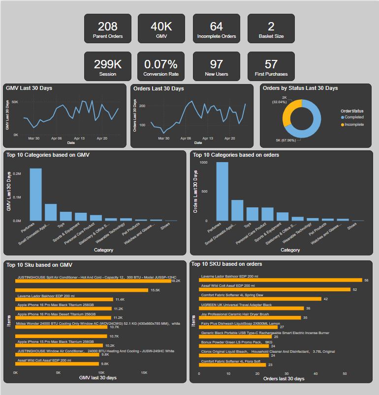
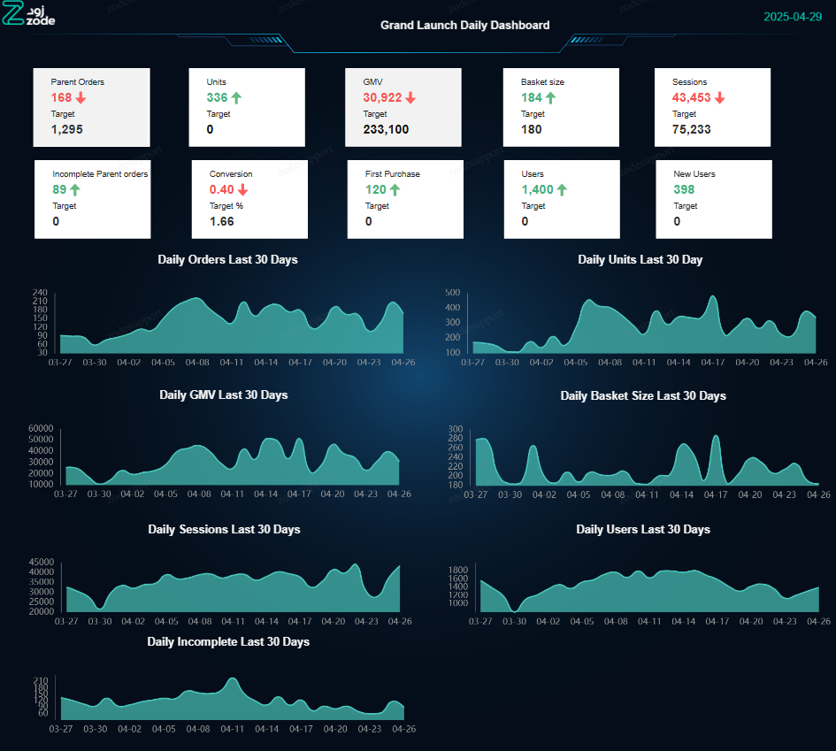
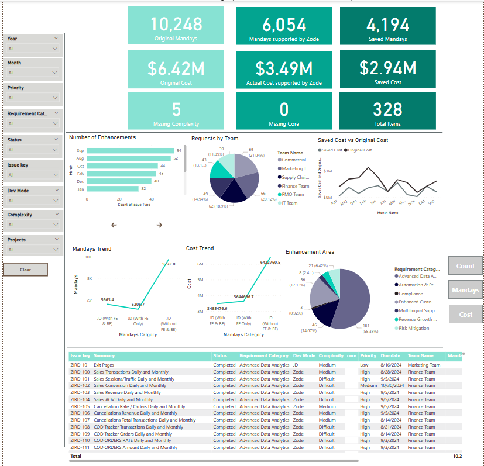
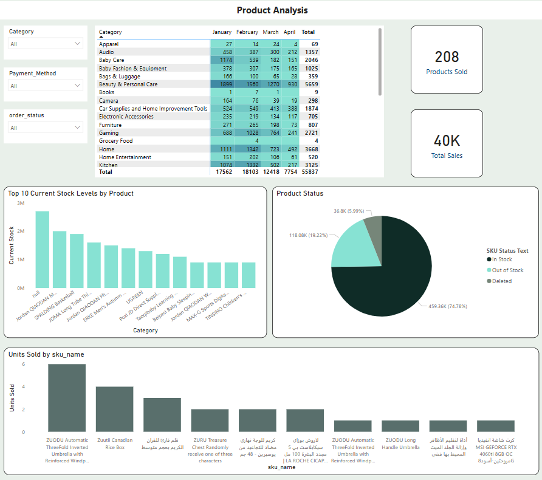
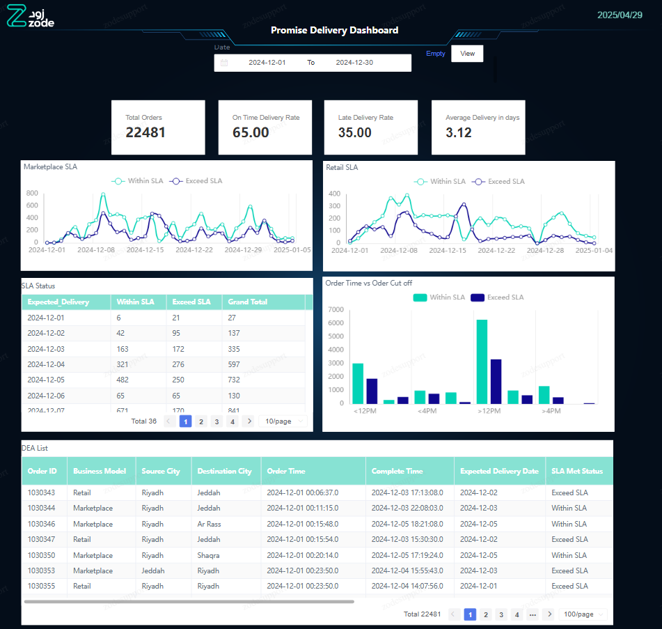
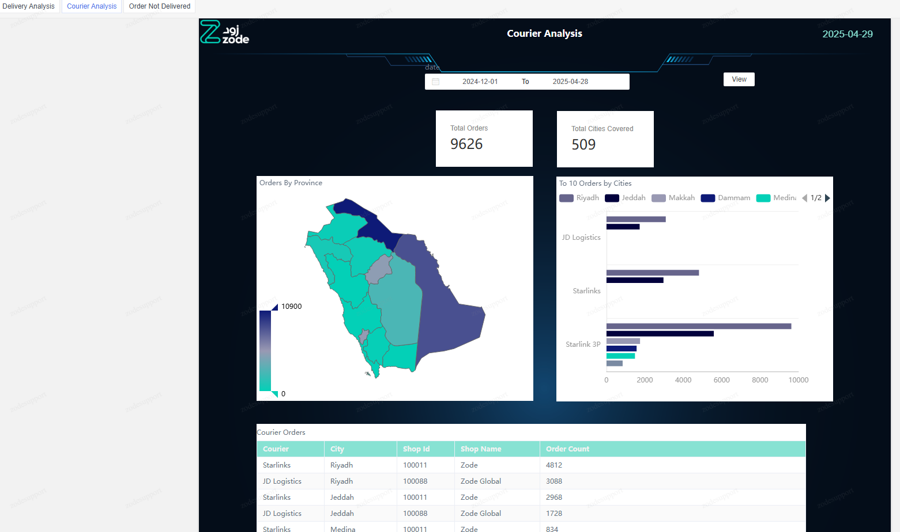
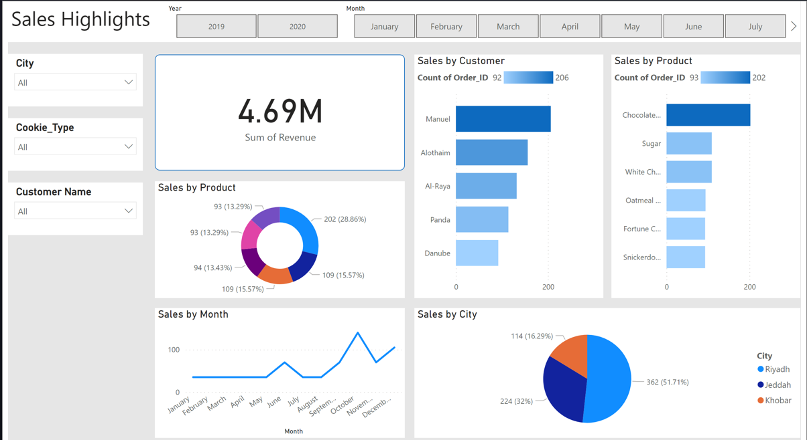
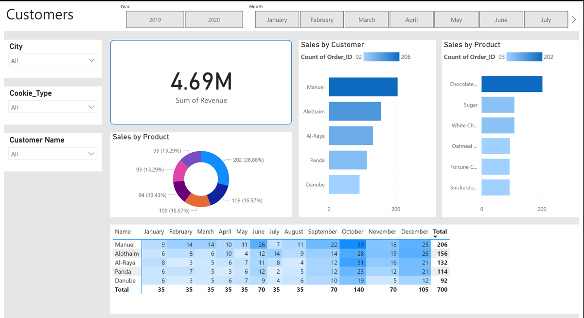
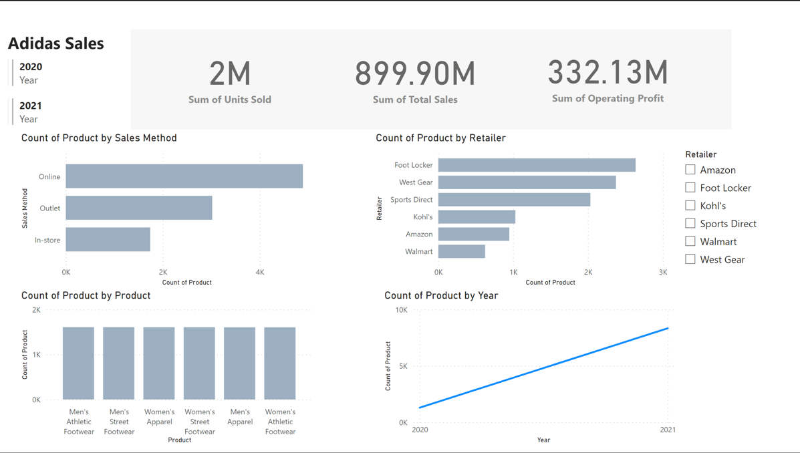

## Project 1: Daily Order & GMV Monitoring Dashboard

This dashboard provides a daily overview of order performance and Gross Merchandise Value (GMV). It includes key metrics and visualizations for top-selling SKUs, helping stakeholders track sales trends, product performance, and revenue insights in real time.
## Preview

## Preview Grand Lanuch Dashboard

## Project 2: IT Services Dashboard: Requests, Savings Amount, and Mandays Overview

This dashboard presents key metrics for IT services, including the number of service requests, total cost savings, and resource effort measured in mandays.
## Preview

## Project 3: Products Analysis Dashboard

This dashboard offers a comprehensive view of product performance across key metrics such as sales, profit, stock levels, and customer engagement. It highlights top and low-performing SKUs, tracks sales vs. profit trends, and provides actionable insights into inventory status and product demand, enabling data-driven decisions for merchandising and supply chain optimization.
## Preview

## Project 4: Order Shipment Analysis

This project features two interactive dashboards:
 - Shipment SLA Dashboard: Tracks order shipments against service level agreements (SLAs), highlighting delays and on-time performance.
## Preview

 - Courier Analysis Dashboard: Breaks down courier performance by region and city, showing total orders delivered and coverage distribution.
## Preview

## Project 5: Sales Highlights by Region and Time

This section summarizes key sales trends by month and city. It highlights customer distribution across regions and provides insights into sales performance.
## Preview

## Project 6: Adidas Sales Sample Dashboard – Unit Sales & Product Distribution

This sample dashboard displays test data for Adidas sales, focusing on units sold and product counts segmented by retailer and sales method (Online, Outlet, In-Store). It provides a simplified view to validate data structures and visual logic before applying to live production data
## Preview

